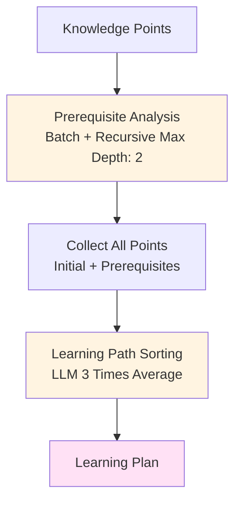
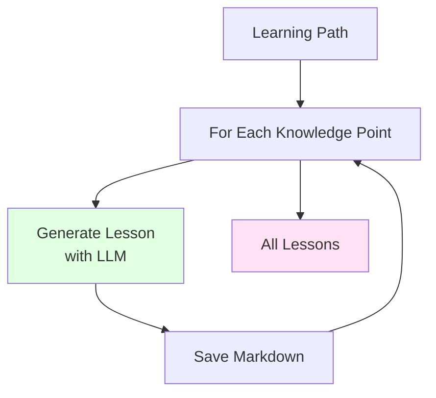

# AI学习方案生成系统

根据用户画像和学习目标，自动生成包含知识点序列的培养方案。

## 功能特性

1. **课程知识点管理**：自动提取或从MD文件读取课程知识点
2. **前置依赖分析**：智能分析知识点之间的依赖关系
3. **学习路径排序**：基于依赖关系、难度等因素生成最优学习顺序
4. **用户画像支持**：根据用户背景定制化学习方案
5. **个性化教案生成**：为每个知识点生成详细的Markdown格式教案，考虑知识点关联和用户背景
6. **基于已有方案生成教案**：可以从已有的学习方案文件直接生成教案，无需重新运行整个流程

## 安装

1. 安装依赖：
```bash
pip install -r requirements.txt
```

2. 配置API密钥：
   - 复制 `config.example.py` 为 `config.py`
   - 在 `config.py` 中填写您的 ModelScope API 密钥

## 使用方法

### 1. 准备用户画像文件

创建YAML格式的用户画像文件，例如 `data/profiles/my_profile.yaml`：

```yaml
user:
  name: "学生姓名"
  background:
    courses:
      - "Python基础"
      - "数据结构与算法"
  learning_goal: "强化学习"
```

**注意**：用户画像中只需要列出学过的课程，系统会自动从课程知识点文档中提取已掌握的知识点。如果某个课程的知识点文档不存在，系统会自动使用LLM生成。

### 2. 运行程序

系统支持四种模式：

#### 模式1：快速测试知识点生成

快速验证知识点生成是否靠谱，不进行耗时的依赖分析和排序：

```bash
# 使用用户画像文件（从文件中读取学习目标）
python main.py points -p data/profiles/my_profile.yaml

# 直接指定学习目标（不需要用户画像文件）
python main.py points -g "强化学习"

# 保存结果到JSON文件
python main.py points -g "强化学习" -o test_points.json
```

**注意**：这个命令只生成知识点，速度很快（通常几秒到几十秒），适合快速验证知识点质量。

#### 模式2：快速测试前置依赖分析（推荐先测试此步骤）

快速验证前置依赖分析是否靠谱，这是最容易出问题的步骤。会进行依赖分析但不进行排序和教案生成：

```bash
# 使用用户画像文件（从文件中读取学习目标）
python main.py prereq -p data/profiles/my_profile.yaml

# 直接指定学习目标（不需要用户画像文件）
python main.py prereq -g "强化学习"

# 保存结果到JSON文件
python main.py prereq -g "强化学习" -o test_prereq.json
```

**注意**：
- 这个命令会进行前置依赖分析（包括递归分析），但跳过排序和教案生成
- 会显示详细的依赖关系，包括初始知识点和前置知识点
- 可以快速验证是否有课程名称被误识别为知识点等问题
- 适合在修改提示词后快速验证效果

#### 模式3：生成完整学习方案

```bash
# 基本用法（自动保存到 data/profiles/ 目录，同时输出到控制台）
python main.py plan data/profiles/my_profile.yaml

# 指定输出文件路径（同时输出到控制台和文件）
python main.py plan data/profiles/my_profile.yaml -o my_plan.json

# 输出为YAML格式
python main.py plan data/profiles/my_profile.yaml -o my_plan.yaml -f yaml

# 生成学习方案的同时生成知识点教案
python main.py plan data/profiles/my_profile.yaml -g

# 同时指定输出文件和生成教案
python main.py plan data/profiles/my_profile.yaml -o my_plan.json -g
```

#### 模式4：基于已有学习方案生成教案

```bash
# 基于已有的学习方案文件生成教案
python main.py lessons data/profiles/示例学生_强化学习_20260104_182849.json

# 提供用户画像文件以获得更准确的个性化教案
python main.py lessons data/profiles/示例学生_强化学习_20260104_182849.json -p data/profiles/my_profile.yaml
```

**注意**：
- **生成学习方案**：
  - 如果不指定 `-o` 参数，系统会自动生成文件名并保存到 `data/profiles/` 目录
  - 文件名格式：`用户名_学习目标_时间戳.格式`（例如：`示例学生_强化学习_20240104_160000.json`）
  - 无论是否指定输出文件，结果都会同时显示在控制台和保存到文件
  - 默认不生成教案，使用 `-g` 或 `--generate-lessons` 参数可生成知识点教案
- **生成教案**：
  - 可以从已有的学习方案文件（JSON或YAML）生成教案
  - 如果提供用户画像文件（`-p` 参数），会使用更完整的用户信息生成个性化教案
  - 如果不提供用户画像文件，会从学习方案中提取基本信息
- **教案文件**：保存在 `data/lessons/` 目录，每个知识点对应一个Markdown文件

## 输出格式

培养方案包含以下信息：

- **user**: 用户信息
- **course**: 课程信息
- **learning_path**: 排序后的知识点列表（包含学习顺序）
- **dependencies**: 知识点依赖关系
- **statistics**: 统计信息

## 工作流程

### 算法框架图

#### 1. 生成培养方案流程 (Learning Plan Generation)



#### 2. 生成教案流程 (Lesson Generation)



### 详细步骤

1. **加载用户画像**：从YAML文件读取用户信息，自动从已学课程的知识点文档中提取已掌握的知识点
2. **获取或生成课程知识点**：如果MD文件不存在，会调用LLM生成并保存
3. **分析每个知识点的前置依赖**：批量分析，限制递归深度为2层，避免过度递归
4. **对所有知识点进行排序**：调用LLM 3次取平均值，提高排序稳定性
5. **生成知识点教案**（可选）：每个知识点生成一个Markdown格式的教案文件
6. **生成并输出培养方案**：输出为JSON或YAML格式，包含完整的学习路径和依赖关系

## 配置说明

在 `config.py` 中可以配置：

- `MAX_KNOWLEDGE_POINTS`: 知识点数量上限（默认100）
- `SORT_RETRY_COUNT`: 排序时调用LLM的次数（默认3次）

## 文件结构

```
simpleDoc/
├── main.py                    # 主程序入口
├── user_profile.py           # 用户画像解析
├── course_knowledge.py       # 课程知识点管理
├── prerequisite_analyzer.py  # 前置依赖分析
├── learning_path.py          # 学习路径排序
├── llm_service.py           # LLM服务封装
├── config.py                # 配置文件（需自行填写API密钥）
├── config.example.py         # 配置文件模板
├── prompts.py               # 提示词模板
├── data/
│   ├── courses/             # 课程知识点MD文件存储目录
│   ├── profiles/            # 用户画像YAML文件和培养方案输出
│   └── lessons/             # 知识点教案MD文件存储目录
└── requirements.txt         # 依赖包
```

## 注意事项

1. **API密钥安全**：`config.py` 包含API密钥，不会被提交到版本控制（已在.gitignore中）
2. **知识点数量限制**：如果知识点超过100个，会自动截断
3. **排序稳定性**：系统会调用LLM 3次进行排序，取平均值以提高稳定性
4. **循环依赖**：系统会自动检测循环依赖，并在排序时处理
5. **教案生成**：每个知识点会生成一个独立的Markdown教案文件，保存在 `data/lessons/` 目录
6. **教案个性化**：教案会根据用户已学课程和已掌握知识点进行个性化定制

## 示例

查看 `data/profiles/example_profile.yaml` 了解用户画像格式示例。
